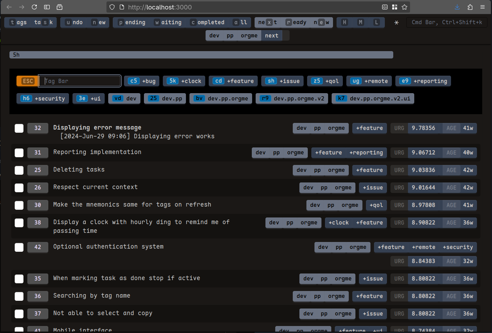
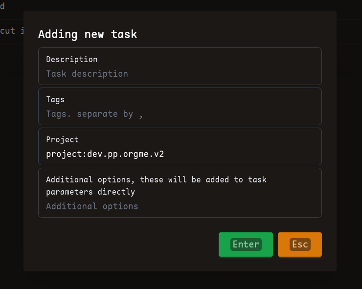
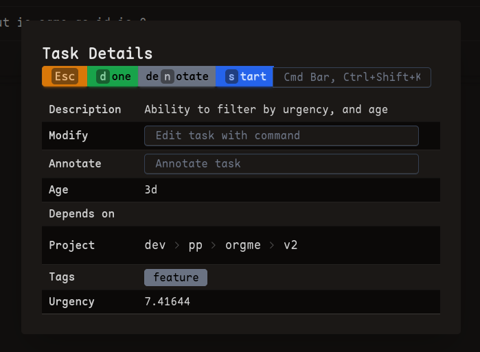

# NEW!

- Updated to tailwindcss 4 and using daisyui for UI components. 
- Cleaned-up code a bit to make it easier to manage

Please report any bugs, contributions are welcome. 

# What is this?

A Minimalistic Web UI for Task Warrior focusing on Keyboard navigation.

It's completely local. No intention to have any kind of online interactions.
Font in the screenshot is [Maple Mono NF](https://github.com/subframe7536/maple-font)

## Stack

* Rust [nightly, will fail to build on stable]
* axum
* tera
* TailwindCSS
* HTMX
* hotkeys
* rollup
* Task Warrior (obviously :) )

Still work in progress. But in the current stage it is pretty usable. You can see the list at the bottom, for what I intend to add, and what's been done.


# Using Release Binary

Latest release binaries are now available. Check the release tags on the sidebar

# Using Docker

Docker image is provided. A lot of thanks go to [DCsunset](https://github.com/DCsunset/taskwarrior-webui)
and [RustDesk](https://github.com/rustdesk/rustdesk/)

```shell 
docker build -t taskwarrior-web-rs . \
&& docker run -d -p 3000:3000 \
-v ~/.task/:/home/builder/.task \
-v ~/.taskrc:/home/builder/.taskrc \
-v /usr/share/doc/task/rc/:/usr/share/doc/task/rc/:ro \
--name taskwarrior-web-rs taskwarrior-web-rs 
```

That should do it.

NOTE: If you have any hooks
(eg. Starting time tracking using time-warrior when we start a task,
you'll need to install the required application in in the docker, also the config files)

# Manual Installation
## Requirements

* rust nightly
* npm
* rollup
* tailwindcss-cli

### Installing rust nightly

Should be installable through `rustup`
https://rustup.rs/

### Installing tailwindcss-cli and rollup

```shell
curl -sLO https://github.com/tailwindlabs/tailwindcss/releases/latest/download/tailwindcss-linux-x64
mv tailwindcss-linux-x64 tailwindcss
chmod +x tailwindcss
```

### Install rollup

```
npm install rollup --global 
```

### Building and Running

1. Clone the latest version from GitHub.
2. `cd frontend`
3. `npm install`
4. `cd ..`
5. `cargo run --release`

That should be it! Now you have the server running at `localhost:3000` accessible by your browser.

### Troubleshooting

if you are receiving the following error in step 5

```shell

  thread 'main' panicked at build.rs:7:19:
  called `Result::unwrap()` on an `Err` value: Os { code: 2, kind: NotFound, message: "No such file or directory" }
  note: run with `RUST_BACKTRACE=1` environment variable to display a backtrace

```

It's because, `tailwindcss-cli` is missing

### Customizing the port

By default, the program will use 3000 as port,
you can customize through `.env` file or enviornment variable, check `env.example`

variable name: `TWK_SERVER_PORT` 

### Displaying `time of the day` widget

By default the "time of the day" widget is not visible, to display it put 

`DISPLAY_TIME_OF_THE_DAY=1`

in the `.env` file


# Using the app

You can use Mouse or Keyboard to navigate.


* All the keyboard mnemonics are underlined.
* The `Cmd Bar` needs to be focused (`Ctrl + Shift + K`) for the keyboard shortcuts to work


## Project and Tag selection

Keyboard shortcut is `t`

For selecting tag, once you enter tag selection mode, the `tag bar` is visible,
tag mnemonics are displayed on the tags, in red boxes, typing the mnemonics will immediately set the tag/project,

Note: selecting the tag/project again will remove the tag from filter.



## Creating new task

Keyboard shortcut is `n`

Which should bring up the new task dialog box. It will use the current tags and project to create the task


## Marking task as done or displaying task details

Call up task search: `s`
This should update top bar with the following, and also the task mnemonics are displayed with the id, in red boxes.
Typing the mnemonics will immediately mark the task as done,
or display the details of the task depending on mnemonics typed


In Task Details window, you can mark task as done[d] and start/stop [s] timer.
Also, denotate task using [n]
You can use task command to modify the task.
You only need to enter the modifications.



Once you start a timer it will be highlighted on the list


## Undo

Keyboard shortcut is `u`

This will bring up undo confirmation dialog


# WIP warning

This is a work in progress application, many things will not work,
there will be errors, as no checks, and there may not be any error messages in case of error.


## Planned
- [ ] Usability improvements on a long task list
  - [x] Hiding empty columns
  - [ ] Temporary highlight last modified row, if visible
- [ ] Make the mnemonics same for tags on refresh
- [ ] Modification
  - [ ] Deleting
- [ ] Following Context
- [ ] Error handling
  - [ ] Retaining input in case of error
  - [ ] Finetune error handling
- [ ] Add more tests
- [ ] Convert to desktop app using Tauri
- [ ] Reporting
  - [ ] Project wise progress
  - [ ] Burndown reports
- [ ] Column customization
- [ ] Color customization
- [ ] Time warrior integration, and time reporting
- [ ] Searching by tag name

## Issues
- [ ] Not able to select and copy tags, maybe add a copy button
- [ ] Keyboard shortcut applied when there is a shortcut key and I use a mnemonic
- [x] When marking task as done stop if active


